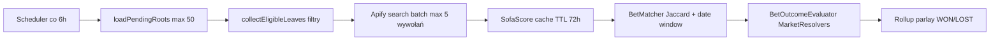

# Raport: skuteczność bet resolvingu przez Apify (SofaScore)

**Data raportu:** 2026-06-29  
**Zakres danych:** zakłady z `retroactive_at_import = 0` (wykluczone rozliczenia retrospektywne przy imporcie).  
**Źródło:** baza MySQL w Dockerze + kod `BetResolutionService`, `ApifySofaScoreClient`, `BetMatcher`, resolvery rynków.  
**Okres prób rozliczenia:** od 26.06.2026 (tabela `bet_resolution_attempt` — 24 cykle, 322 próby).

---

## 1. Skuteczność rozliczania

### 1.1 Nogi zakładów (główna metryka)

| Metryka | Wartość |
|--------|---------|
| Wszystkie nogi (non-retro) | **119** |
| Rozliczone WON/LOST | **49 (41,2%)** |
| Nadal PENDING | **70 (58,8%)** |
| Rozliczone przez Apify (`APIFY_SOFASCORE`) | **34 (28,6% wszystkich nóg, 69,4% rozliczonych)** |
| Rozliczone bez źródła (ręcznie / przed trackingiem) | **15** |

### 1.2 Kupony i single (korzenie)

| Typ | WON | LOST | PENDING |
|-----|-----|------|---------|
| **PARLAY** | 2 | 14 | **11** |
| **SINGLE** | 7 | 4 | **31** |

Kupony są rozliczane kaskadowo: jedna przegrana noga → kupon LOST od razu. Kupon WON wymaga rozstrzygnięcia **wszystkich** nóg (lub mieszanki WON+VOID z poprawnym kursem).

### 1.3 Rynki rozliczone przez Apify

| Rynek | WON | LOST |
|-------|-----|------|
| TOTALS_OVER_UNDER | 9 | 12 |
| MONEYLINE_1X2 | 8 | 3 |
| HANDICAP | 1 | 1 |

Apify dobrze radzi sobie z prostymi rynkami opartymi na wyniku końcowym meczu. Brak rozliczeń Apify dla BTTS, correct score, bet builderów, outrightów.

### 1.4 Skuteczność cykli rozliczeniowych (ostatnie 4 dni)

| `error_code` | Próby | % |
|--------------|-------|---|
| **BELOW_THRESHOLD** | 277 | **86,0%** |
| NO_MATCH | 19 | 5,9% |
| UNRESOLVED_MARKET | 12 | 3,7% |
| **SUCCESS** | 8 | **2,5%** |
| EMPTY_POOL | 6 | 1,9% |

- Dotkniętych unikalnych zakładów: **37** z ~70 pending z próbami.
- Średnia confidence przy udanym rozliczeniu Apify: **~0,996** (próg: **0,85** w prod, **0,82** w dev).
- „Near miss” (confidence 0,75–0,84, nadal PENDING): **3 nogi** — niewielka liczba, ale realna szansa na szybki zysk po obniżeniu progu lub lepszym matcherze.

### 1.5 Werdykt skuteczności

| Obszar | Ocena |
|--------|-------|
| Proste single (1X2, O/U na znanych ligach) | **Dobra** — większość udanych rozliczeń Apify |
| Kupony wielonogowe | **Słaba** — 11/27 kuponów PENDING; wiele nóg w ogóle nie trafia do pipeline’u |
| Player props / statystyki | **Brak** — scraper nie pobiera statystyk |
| Outrighty / futures (MŚ 2026) | **Brak** — celowo odfiltrowane |
| Ogólna skuteczność auto-resolvingu | **~28% nóg przez Apify**, **~41% łącznie z ręcznym** |

---

## 2. Architektura — jak to działa i co ulepszyć

### 2.1 Obecny pipeline



**Kluczowe ograniczenia konfiguracyjne** (`application.properties`):

- `apify-mode=search` — batch search po nazwach drużyn
- `max-apify-calls-per-cycle=5` — max ~40 zapytań/cykl (batch po 8)
- `max-bets-per-run=50` — tylko 50 najnowszych korzeni
- `search-cooldown-hours=24` — po nieudanej próbie czeka 24h
- `match-confidence-threshold=0.85`
- `includeStatistics/Incidents/Lineups=false` w Apify

### 2.2 Propozycje ulepszeń architektonicznych

#### A. Rozdzielenie pipeline’u na 3 warstwy

| Warstwa | Odpowiedzialność | Korzyść |
|---------|------------------|---------|
| **Discovery** | Znajdź mecz w SofaScore (search / URL / tournament schedule) | Niezależne skalowanie i retry |
| **Enrichment** | Pobierz szczegóły meczu (wynik, statystyki, sety) | Osobny koszt tylko dla trafionych meczów |
| **Settlement** | Market resolvers na pełnych danych | Czystsza logika, łatwiejsze testy |

Dziś discovery i settlement dzielą jedną pulę eventów z ograniczonym payloadem (tylko wynik końcowy).

#### B. Dwuetapowe dopasowanie meczu

1. **Candidate retrieval** — obecny Jaccard + query PL→EN (szeroki recall).
2. **Re-ranking** — data meczu, sport, płeć (K), turniej, podobieństwo Levenshtein na nazwach drużyn.

86% błędów to `BELOW_THRESHOLD` — problem jest w matcherze, nie w evaluatorze rynku.

#### C. Priorytetyzacja zamiast FIFO

Kolejka powinna preferować:

- nogi z confidence 0,75–0,84 (near miss),
- nogi blokujące kupon (2/5 WON, reszta PENDING),
- mecze zakończone >48h temu,
- nogi z cache hit (tanie rozliczenie).

#### D. Per-leg resolution state dla parlayów

Dziś kupon PENDING, gdy choć jedna noga PENDING — nawet jeśli 2 nogi są już WON. Warto:

- zapisywać postęp per noga (`resolution_state`, `blocking_reason`),
- rozliczać kupon LOST natychmiast (już jest),
- rozważyć partial audit trail bez czekania na wszystkie nogi.

#### E. Market type inference przy imporcie (AI/OCR)

**31 z 70 pending nóg** ma `market_type = NULL` i **nigdy nie było próby**. Inference na etapie importu (Gemini) zamiast w runtime rozwiązałoby połowę backlogu.

#### F. Konfiguracja Apify per sport

```java
// ApifySofaScoreClient.baseBody() — dziś wszystko wyłączone
includeStatistics=false, includeIncidents=false, includeLineups=false
```

Dla propsów i bet builderów potrzebny tryb **enriched fetch** tylko dla meczów już zmatchowanych (kontrola kosztu ~$0.08/wywołanie).

#### G. Observability

Tabela `bet_resolution_attempt` jest dobra, ale:

- tylko **8 SUCCESS** vs **34 rozliczenia Apify** — część rozliczeń mogła nastąpić przed pełnym trackingiem lub bez zapisu SUCCESS,
- brak metryk: koszt/cykl, query→match rate, czas do rozliczenia od `event_date`,
- warto dodać dashboard (Prometheus/Grafana lub prosty endpoint admin).

---

## 3. Czego brakuje w scraperze / dlaczego parlaye i nogi zostają PENDING

### 3.1 Nogi w ogóle nie kwalifikują się do Apify (50% pending)

Z **70 pending nóg**, **35 nigdy nie miało próby**:

| Przyczyna | Liczba | Przykład |
|-----------|--------|----------|
| `market_type = NULL` + niesearchable `event_name` | **31** | „Mistrzostwa Świata 2026 — dokładna klasyfikacja grupy E” |
| Za świeże (`min-hours-after-placed=3`) | 7 | — |
| Brak `event_name` | 0 | — |

`ResolutionNameTranslator` **odrzuca** m.in.:

- outrighty (`mistrzostwa`, `awansuje`, `klasyfikacja`, `dokladna klasyfikacja`),
- złożone opisy (`bet builder` w nazwie eventu),
- nieznane skróty (np. WKS ≤3 znaki).

**Efekt na parlayach:** kupon 161 ma **8/8 nóg PENDING** — wszystkie to futures MŚ 2026 bez szans na match w SofaScore search.

### 3.2 Apify zwraca dane, ale matcher nie przekracza progu (86% prób)

Typowe przypadki z bazy:

| Noga | Confidence | Problem |
|------|------------|---------|
| West Ham - Leeds | 0,75 | Near miss — próg 0,85 |
| Kanada - Bośnia | 0,50 | Słabe mapowanie PL→EN |
| Yulia Putintseva - Camila Osorio | 0,80 | Tenis — nazwiska vs tokenizacja |
| L.Jurgenson/E.Kuivonen - M.Abdala/A.Ghig | 0,00 | Debel tenisowy — format nazw |
| Portugalia vs Uzbekistan | 0,33 | Różne separatory / aliasy |

Scraper **nie zwraca** alternatywnych identyfikatorów (team ID, event ID) — matching opiera się wyłącznie na tokenach nazw drużyn.

### 3.3 Mecz znaleziony, rynek nierozstrzygalny (`UNRESOLVED_MARKET`)

Przykład: zakład **111** — „Manchester City vs Aston Villa”, selekcja **Exact Score**, `market_type=MONEYLINE_1X2` (błędna klasyfikacja), confidence=1.0.

Problemy:

- **mismatch market_type vs selection** — evaluator nie rozliczy,
- scraper nie ma danych poza `homeScore`/`awayScore`/`winnerCode`,
- brak statystyk: faule, strzały, kartki, asy w secie.

Inne nierozliczalne selekcje w pending:

- „Marek B. (żółta kartka) Powyżej 1.5” — **player props**,
- „Podwójna szansa: 1X + Strzały H2H: Niemcy” — **kompozyt** bez `builderConditionsJson`,
- „Bet Builder” (Senegal-Irak, NZ-Belgia) — brak JSON warunków.

### 3.4 Brak meczu w puli (`NO_MATCH`)

| Noga | Sport | Uwaga |
|------|-------|-------|
| Filipiny [K] - Australia [K] | Volleyball | SofaScore search nie zwrócił meczu |
| Urugwaj - Hiszpania | Football | Mecz poza batch/cooldown |

Volleyball, motorsport i niszowe ligi są słabo pokryte trybem `search` z limitami wywołań.

### 3.5 Ograniczenia batch search Apify

- `max-apify-calls-per-cycle=5` — przy wielu unikalnych query część nóg dostaje `NO_APIFY_DATA` / czeka na następny cykl,
- `max-bets-per-run=50` — starsze kupony mogą być stale pomijane,
- cooldown 24h po `BELOW_THRESHOLD` — noga z confidence 0,80 czeka dobę mimo że mecz jest zakończony.

### 3.6 Specyfika parlayów — dlaczego kupon zostaje PENDING

Stan **11 pending parlayów**:

| Kupon | WON | LOST | PENDING | Blokada |
|-------|-----|------|---------|---------|
| 208 | 2 | 0 | 3 | 1 noga NULL (darts deble), 2× O/U below threshold |
| 224 | 1 | 0 | 1 | 1 noga kompozytowa NULL market |
| 255 | 2 | 0 | 3 | 3× tenis O/U below threshold |
| 236 | 0 | 0 | 5 | 5× tenis ML/O/U below threshold |
| 161 | 0 | 0 | 8 | 8× outright MŚ 2026 — niesearchable |

**26 nóg** w pending parlayach **nigdy nie było próby** (głównie NULL market / outright).  
**11 nóg** ma ostatni błąd `BELOW_THRESHOLD` — mecz prawdopodobnie istnieje w SofaScore, ale matcher go nie „zatwierdza”.

Kupon **mógłby** być LOST/WON gdyby te nogi zostały rozliczone — dziś architektura **nie rozlicza parcialnie** poza scenariuszem LOST na jednej nodze.

### 3.7 Checklist: czego brakuje w scraperze Apify

| Brak | Wpływ |
|------|-------|
| Statystyki meczu (strzały, faule, kartki, rożne) | Player props, bet buildery ze statystykami |
| Dane setowe / gemowe (tenis) | „1. set — liczba asów”, handicap setowy |
| Identyfikatory drużyn/zawodników | Stabilniejsze matching niż Jaccard na nazwach |
| Outrighty / futures / klasyfikacje grup | Cała klasa zakładów MŚ 2026 |
| Player-level incidents | Kartki, gole strzelca |
| Siatkówka, motorsport, niższe ligi | NO_MATCH |
| Deble (tenis, darts) — normalizacja nazw par | confidence = 0 |
| Pobieranie po URL meczu (gdy znany) | Omija search i batch limits |
| Status „finished” bez score (edge cases) | `BetOutcomeEvaluator` zwraca empty |

---

## 4. Rekomendacje priorytetowe

| Priorytet | Działanie | Szacowany wpływ |
|-----------|-----------|-----------------|
| **P0** | Inference `market_type` + searchable `event_name` przy imporcie AI | +~26% pending (31 nóg nigdy nie próbowane) |
| **P0** | Ulepszenie matchera (deble, tenis, aliasy PL, re-ranker) | Redukcja 86% `BELOW_THRESHOLD` |
| **P1** | Enriched Apify fetch (`includeStatistics=true`) tylko po matchu | Player props, bet buildery |
| **P1** | Zwiększyć `max-apify-calls-per-cycle`, priorytetyzacja kolejki | Mniej `NO_APIFY_DATA` / EMPTY_POOL |
| **P2** | Osobny resolver outrightów (inny actor/API) | Futures MŚ 2026 |
| **P2** | Obniżyć próg do 0,80 lub dynamiczny próg per sport | +3 near-miss natychmiast |

---

## 5. Podsumowanie

Apify SofaScore scraper **działa poprawnie dla prostych zakładów** na znanych meczach piłkarskich (1X2, over/under) — stąd 34 automatyczne rozliczenia z wysoką confidence (~0,99). System **nie jest jednak kompletny** jako silnik rozliczania kuponów: **58,8% nóg pozostaje PENDING**, a w próbach rozliczeniowych **tylko 2,5% kończy się SUCCESS**.

Główne przyczyny w kolejności wag:

1. **Filtrowanie pre-Apify** — outrighty, bet buildery bez JSON, NULL market (50% pending bez próby).
2. **Słabe dopasowanie nazw** — 86% błędów to `BELOW_THRESHOLD`.
3. **Brak danych statystycznych w scraperze** — propsy i złożone selekcje.
4. **Limity kosztowe Apify** — batch/cooldown/FIFO zamiast priorytetyzacji.
5. **Parlay rollup** — kupon czeka na wszystkie nogi; jedna nierozliczalna noga blokuje całość.

---

## Po implementacji (plan 2026-06-29)

> **Status:** do uzupełnienia po backfillu (`bet.resolution.backfill-on-startup=true`) i ręcznym uruchomieniu auto-rozliczania (`POST /api/bets/resolve-pending?force=true`).

### Metryki (wypełnić po runie)

| Metryka | Przed (baseline) | Po | Δ |
|---------|------------------|----|---|
| Nogi rozliczone WON/LOST (non-retro) | 49 (41,2%) | _TBD_ | _TBD_ |
| Nogi PENDING (non-retro) | 70 (58,8%) | _TBD_ | _TBD_ |
| Rozliczenia przez Apify (`APIFY_SOFASCORE`) | 34 | _TBD_ | _TBD_ |
| `SUCCESS` w `bet_resolution_attempt` (24h) | _TBD_ | _TBD_ | _TBD_ |
| `BELOW_THRESHOLD` w attempts (24h) | _TBD_ | _TBD_ | _TBD_ |
| Nogi z `market_type IS NULL` (PENDING) | 31 | _TBD_ | _TBD_ |

**Oczekiwane:** wzrost `WON`/`LOST`, spadek udziału `BELOW_THRESHOLD`, wzrost `SUCCESS`, spadek nóg z NULL `market_type`.

### Zapytania SQL (docker exec sportsbetting_db mysql …)

```sql
-- 1. Status nóg (non-retro) — główna metryka skuteczności
SELECT status, COUNT(*)
FROM bet
WHERE retroactive_at_import = 0 AND parent_bet_id IS NOT NULL
GROUP BY status;

-- 2. Błędy rozliczenia w ostatnich 24h
SELECT error_code, COUNT(*)
FROM bet_resolution_attempt
WHERE attempted_at > NOW() - INTERVAL 1 DAY
GROUP BY error_code
ORDER BY COUNT(*) DESC;

-- 3. Pending nogi bez market_type (efekt backfillu enrichera)
SELECT COUNT(*)
FROM bet
WHERE status = 'PENDING'
  AND parent_bet_id IS NOT NULL
  AND retroactive_at_import = 0
  AND market_type IS NULL;

-- 4. Korzenie PENDING (single vs parlay)
SELECT bet_type, COUNT(*)
FROM bet
WHERE status = 'PENDING' AND parent_bet_id IS NULL
GROUP BY bet_type;

-- 5. Rozliczenia Apify vs ręczne (nogi)
SELECT resolution_source, status, COUNT(*)
FROM bet
WHERE retroactive_at_import = 0
  AND parent_bet_id IS NOT NULL
  AND status IN ('WON', 'LOST')
GROUP BY resolution_source, status;
```
